# Database foundation and phased delivery plan

**Status:** Schema foundation implemented and locally verified; application services and hosted instances remain pending  
**Updated:** 2026-08-24  
**Implementation commit:** `7f212b7` (`chore(db): establish postgres schema foundation`)  
**Authority:** This document records the implemented PostgreSQL contract and the next delivery phases. Product-discovery decisions remain authoritative in [`../15-shop-product-discovery-map.md`](../15-shop-product-discovery-map.md).

## 1. Current outcome

The repository now contains a reproducible PostgreSQL 16 and Drizzle foundation for identity, authentication, catalogue, pricing, inventory, carts, orders, payments, audit, and notification delivery.

Implemented now:

- 48 tables and 20 PostgreSQL enums in one application schema;
- UUID primary keys for core entities, `bigint` rial amounts, and UTC `timestamptz` timestamps;
- explicit foreign keys, delete behavior, checks, partial uniqueness, and query-path indexes;
- Persian-first translation tables with `fa`, `en`, and `ar` locale records;
- deterministic Persian/Arabic search normalization;
- explicit inventory reservations and append-only inventory movements;
- checkout, payment, receipt-claim, event, and settlement idempotency keys;
- generated SQL, Drizzle journal, and schema snapshot committed together;
- deterministic reference seed data only: three locales, five concerns, and ten reviewed translations.

Not implemented yet:

- Better Auth runtime configuration or adapter mapping;
- customer phone OTP, staff email/password+TOTP, session, or authorization services;
- catalogue read models, PLP/PDP queries, Server Actions, or Route Handlers;
- cart, reservation, checkout, payment, and settlement transaction services;
- Storyderm products, real SKUs, prices, stock, or Arabic catalogue translations;
- Neon preview infrastructure, Liara production PostgreSQL, backups, restore drills, or deployment automation.

The database contract is ready for schema review. The application is not yet a database-backed shop.

## 2. Environment topology

| Environment | PostgreSQL target | Purpose | Status |
|---|---|---|---|
| Local | PostgreSQL 16 | development, migration, seed, and concurrency testing | Verified against PostgreSQL 16.9; reproducible provisioning still needs a checked-in Compose or equivalent runbook |
| CI | Disposable PostgreSQL 16 | migrate from zero, seed twice, invariant and concurrency tests | Pending |
| Preview | Neon branch or disposable PostgreSQL | optional development and pull-request previews only | Pending and optional |
| Staging | Iranian managed PostgreSQL 16 | deployment rehearsal, payment sandbox, restore verification | Pending |
| Production | Managed PostgreSQL 16 beside the app in Iran, preferably Liara if the app is on Liara | customer data and commerce | Pending provider acceptance, credentials, backup policy, and restore drill |

Each environment uses a separate database. Production does not share a database with staging, preview, or development. The current design uses one database and one application schema; code modules remain the domain boundary until independent ownership or security requirements justify a physical split.

## 3. Schema ownership

| Area | Tables | Source |
|---|---|---|
| Identity and auth | `locale`, `person`, `person_role`, `address`, `auth_account`, `auth_session`, `auth_verification`, `auth_rate_limit` | `src/lib/db/schema/identity.ts` |
| Catalogue reference | `brand`, `brand_translation`, `product_line`, `product_line_translation`, `category`, `category_translation`, `concern`, `concern_translation`, `skin_state`, `skin_state_translation`, `protocol`, `protocol_translation`, `protocol_phase`, `protocol_phase_translation` | `src/lib/db/schema/catalog-reference.ts` |
| Product catalogue | `product`, `product_translation`, `product_media`, `product_media_translation`, `variant`, `variant_translation`, `product_concern`, `product_skin_state`, `product_protocol_phase` | `src/lib/db/schema/catalog.ts` |
| Pricing and inventory | `price`, `price_adjustment_batch`, `price_history`, `inventory`, `inventory_movement` | `src/lib/db/schema/pricing-inventory.ts` |
| Cart and reservations | `cart`, `cart_item`, `inventory_reservation` | `src/lib/db/schema/cart.ts`, `reservation.ts` |
| Orders | `customer_order`, `order_line` | `src/lib/db/schema/order.ts` |
| Payments and fulfilment | `payment`, `bank_transfer_claim`, `payment_event`, `payment_settlement`, `shipment` | `src/lib/db/schema/payment.ts` |
| Operations | `audit_log`, `notification_outbox` | `src/lib/db/schema/audit.ts` |

## 4. Logical ERD

```mermaid
erDiagram
  LOCALE ||--o{ PERSON : preferred_locale
  PERSON ||--o{ PERSON_ROLE : has
  PERSON ||--o{ ADDRESS : owns
  PERSON ||--o{ AUTH_ACCOUNT : authenticates
  PERSON ||--o{ AUTH_SESSION : opens

  BRAND ||--o{ BRAND_TRANSLATION : localizes
  BRAND ||--o{ PRODUCT_LINE : contains
  PRODUCT_LINE ||--o{ PRODUCT_LINE_TRANSLATION : localizes
  CATEGORY ||--o{ CATEGORY : parent_of
  CATEGORY ||--o{ CATEGORY_TRANSLATION : localizes
  CONCERN ||--o{ CONCERN_TRANSLATION : localizes
  SKIN_STATE ||--o{ SKIN_STATE_TRANSLATION : localizes
  PROTOCOL ||--o{ PROTOCOL_TRANSLATION : localizes
  PROTOCOL ||--o{ PROTOCOL_PHASE : contains
  PROTOCOL_PHASE ||--o{ PROTOCOL_PHASE_TRANSLATION : localizes

  BRAND ||--o{ PRODUCT : owns
  PRODUCT_LINE o|--o{ PRODUCT : groups
  CATEGORY o|--o{ PRODUCT : classifies
  PRODUCT ||--o{ PRODUCT_TRANSLATION : localizes
  PRODUCT ||--o{ PRODUCT_MEDIA : illustrates
  PRODUCT_MEDIA ||--o{ PRODUCT_MEDIA_TRANSLATION : localizes
  PRODUCT ||--o{ VARIANT : offers
  VARIANT ||--o{ VARIANT_TRANSLATION : localizes
  PRODUCT ||--o{ PRODUCT_CONCERN : addresses
  CONCERN ||--o{ PRODUCT_CONCERN : filters
  PRODUCT ||--o{ PRODUCT_SKIN_STATE : suits
  SKIN_STATE ||--o{ PRODUCT_SKIN_STATE : filters
  PRODUCT ||--o{ PRODUCT_PROTOCOL_PHASE : participates
  PROTOCOL_PHASE ||--o{ PRODUCT_PROTOCOL_PHASE : sequences

  VARIANT ||--o{ PRICE : priced_as
  VARIANT ||--|| INVENTORY : stocked_as
  VARIANT ||--o{ INVENTORY_MOVEMENT : records
  PRICE_ADJUSTMENT_BATCH o|--o{ PRICE_HISTORY : groups
  VARIANT ||--o{ PRICE_HISTORY : changes

  PERSON o|--o{ CART : owns
  CART ||--o{ CART_ITEM : contains
  VARIANT ||--o{ CART_ITEM : selected
  CART_ITEM ||--o| INVENTORY_RESERVATION : holds
  VARIANT ||--o{ INVENTORY_RESERVATION : reserves

  PERSON o|--o{ CUSTOMER_ORDER : places
  CUSTOMER_ORDER ||--o{ ORDER_LINE : snapshots
  VARIANT ||--o{ ORDER_LINE : references
  ORDER_LINE o|--o{ INVENTORY_RESERVATION : consumes
  CUSTOMER_ORDER ||--o{ PAYMENT : attempts
  PAYMENT ||--o{ PAYMENT_EVENT : records
  PAYMENT ||--o{ BANK_TRANSFER_CLAIM : claims
  PAYMENT ||--o| PAYMENT_SETTLEMENT : settles_once
  CUSTOMER_ORDER ||--o{ SHIPMENT : fulfils
```



Translation relationships to `locale` are omitted from the diagram after the first examples to keep it readable. Every translation table has an explicit locale foreign key.

## 5. Database-enforced invariants

- Money is always a non-negative integer count of rials in `bigint` columns.
- Display calendars and toman conversion never enter persistence.
- A product cannot be published unless it is approved and has `published_at`.
- Inventory `on_hand` and resulting movement balances cannot be negative.
- Reserved stock is derived with the read predicate `status = 'active' AND expires_at > now()`; the partial index covers active rows, while request-time expiry handling provides cleanup. No mutable `reserved` counter exists and no sweeper is required for correctness.
- Each cart has exactly one owner: a person or an anonymous-key hash.
- Quantities are positive and order-line totals equal unit price multiplied by quantity.
- Order totals equal subtotal plus shipping minus discount.
- Checkout, inventory movements, reservations, claims, and payments have unique idempotency keys.
- A payment can have at most one settlement.
- Provider authority, provider reference, and provider event identifiers are unique when present.
- A submitted bank-transfer claim has no reviewer; accepted or rejected claims require reviewer and review time.
- One primary locale, one active cart per owner, one primary product image, and one active reservation per cart item are enforced with partial unique indexes.

## 6. Transaction boundaries still to implement

The schema supplies constraints and indexes; application transactions remain pending. The complete Cart-through-returns contract is [`cart-checkout-payment-fulfilment-and-returns.md`](cart-checkout-payment-fulfilment-and-returns.md), and auth/account lifecycle is [`authentication-and-account-security.md`](authentication-and-account-security.md).

### Cart quantity and reservation

One transaction must lock the cart, validate its version and ownership, upsert the absolute item quantity, calculate available stock from `inventory.on_hand` minus active reservations, then create or renew the reservation. A request retry must return the same outcome rather than incrementing twice.

### Gateway settlement

One transaction must lock the payment, order, relevant reservations, and inventory rows in stable variant order; verify provider evidence; recompute totals server-side; insert the unique settlement; decrement inventory; append movement rows; consume reservations; and transition payment/order state exactly once.

### Bank-transfer review

A receipt is only a claim. Staff acceptance must match real bank evidence. If the original reservation expired, the transaction must re-reserve current stock atomically. If stock is unavailable, the order must not become paid and must enter an explicit refund-or-contact workflow.

## 7. Catalogue, PLP, and search readiness

The schema supports brand, line, category, concern, skin-state, and protocol-phase filters; exact-locale translations; ordered primary/gallery media; customer-group pricing; and derived availability.

The application read layer is still missing. It should expose three server-only contracts:

```text
getShopHub(locale) -> ShopHubPageModel
listProducts(locale, scope, rawSearchParams) -> ProductListingPageModel
getProduct(locale, slug) -> ProductDetailPageModel
```

Server Components call these Drizzle queries directly. Do not add an internal HTTP API solely for the Next.js application to call itself. Route Handlers are appropriate for a real external consumer, webhooks, or a health endpoint.

Persian search input is normalized at the write and query boundaries. DB3 adds the accepted Arabic-form folds (`أإآٱ -> ا`, `ة -> ه`) and records that ZWNJ-to-space does not make a no-separator spelling identical. DB3 also enables `pg_trgm` and adds a GIN trigram index on `product_translation.normalized_search_text`; representative infix/typo queries must then prove index use with `EXPLAIN (ANALYZE, BUFFERS)`. PostgreSQL's lack of a Persian stemmer makes trigram the launch choice over a speculative full-text configuration.

## 8. API and service status

| Capability | Intended boundary | Status |
|---|---|---|
| Database health | `GET /api/health`, real `SELECT 1` with timeout | Pending |
| Authentication | Better Auth server integration plus Iranian SMS adapter; customer phone OTP, staff password+TOTP | Pending runtime compatibility spike; see dedicated auth plan |
| Catalogue reads | server-only Commerce read module called by Server Components | Pending |
| PLP filters/search | Zod-parsed URL parameters into one canonical query pipeline | Pending decision-map #5 and implementation |
| Cart mutations | Server Actions: Zod parse, ownership/auth check, transactional service | Pending |
| Checkout | Server Action with server-computed totals and checkout idempotency | Pending |
| Gateway callbacks | Route Handler with provider verification and idempotent settlement | Pending |
| Bank-transfer review | staff-only Server Action with audit event | Pending |

## 9. Migration and seed workflow

The accepted workflow is:

```text
edit Drizzle schema
  -> generate SQL
  -> review SQL and snapshot
  -> migrate a fresh PostgreSQL 16 database
  -> run deterministic seeds twice
  -> assert exactly one primary locale exists after each seed run
  -> run invariant and concurrency tests
  -> commit schema, SQL, journal, and snapshot together
```

`drizzle-kit push` is allowed only for disposable experiments. Production migrations are a release step run by a restricted deploy identity after a verified backup. Structural changes follow expand, backfill, validate, and contract; destructive contraction never ships while deployed code still reads the old shape.

## 10. Verification recorded for migration 0000

- TypeScript typecheck passed.
- Eight focused schema, seed, and Persian-normalization tests passed.
- Migration applied from zero to PostgreSQL 16.9 using UTF-8.
- Database reported exactly 48 public tables and 20 public enums.
- Foreign-key audit reported zero keys without a supporting index.
- Reference seed ran twice without duplication: 3 locales, 5 concerns, 10 translations.
- Persian values round-tripped without corruption.
- Live SQL rejected a published draft, negative inventory, a duplicate payment idempotency key, and a second settlement.
- Next.js production compilation passed in webpack mode. Turbopack was blocked only in the isolated verification worktree because its dependency directory was an external symlink.

The disposable verification database was removed after the checks.

## 11. Accepted review corrections before application services

The read-only review in [`../16-review-storefront-and-database.md`](../16-review-storefront-and-database.md) is accepted as planning input. No correction below is represented as implemented until its migration and live PostgreSQL tests land.

| Correction | Delivery phase |
|---|---|
| Required immutable `customer_order.contact_phone`; replace person-dependent contact check | COM0, before account closure or settlement |
| Composite settlement FK `(payment_id, order_id) -> payment(id, order_id)` | COM0, before settlement |
| `pg_trgm` GIN and expanded Arabic/Persian normalization | DB3, before production PLP search |
| Nullable reservation cart-item link with `SET NULL` plus historical `source_cart_id` | COM0, before Cart removal |
| Payment/shipment status-timestamp checks | COM0 |
| Order-line uniqueness, E.164 phone check, payment-event enum | AUTH0/COM0 |
| Remove decorative `price.effective_at`; scheduled prices remain unsupported | COM0 |
| Purchasability read predicate requires exact-locale translation, active variant, public/customer-group price, and approved media | DB3 read model and staff publication gate |
| Notification outbox table remains; a general worker is deferred | Commerce transaction writes insert rows, delivery phase separately approved |

## 12. Phased continuation plan

| Phase | Deliverable | Exit gate | Status |
|---|---|---|---|
| DB0 | Canonical schema, migration 0000, snapshot, seed, Persian normalization | Fresh PostgreSQL migration and repeatable seed pass | Complete |
| DB1 | Reproducible local/CI PostgreSQL 16 | New checkout can provision, migrate, seed twice, assert exactly one primary locale, and run invariant tests | Next |
| DB2 | Better Auth runtime spike and identity mapping, parallel with DB3 | Customer phone OTP and staff password+TOTP create compatible users/sessions; limits, roles, and logout verified | Pending; blocks DB5, not public reads |
| DB3 | Catalogue read models, Arabic/Persian normalization correction, `pg_trgm` GIN, and query fixtures | Persian hub/list/detail reads use PostgreSQL with stable pagination, exact-locale/purchasability policy, and measured infix search | Pending; may run parallel with DB2 |
| DB4 | `/fa/shop`, PLP/search, and PDP vertical slice | Routes render from PostgreSQL with JavaScript disabled; empty/error states tested | Pending research gates |
| DB5 | COM0 corrections plus Cart and reservation services | Concurrent requests cannot oversell; removal works; retries/merge are idempotent; expiry predicate is observable | Pending; requires DB2 |
| DB6 | Checkout, settlement, fulfilment, return, and refund services | Duplicate callbacks/refunds apply once; stock, money, order, movement, audit, and outbox commit atomically | Pending |
| DB7 | Liara staging/production operations and `/api/health` | Health, TLS, latency, backups, restore drill, migration role, slow-query visibility, and alerts pass | Pending credentials/provider setup |
| DB8 | Booking and academy migrations | Added only after the commerce vertical slice and operational gates pass | Deferred |

## 13. Review checklist

- Review table and column names against the domain language.
- Verify the Better Auth adapter mapping before auth code depends on it.
- Verify deterministic `.invalid` placeholder email and customer-password rejection from the auth plan.
- Verify the late bank-transfer `funds_received` + `payment_review` refund-or-contact state from the transaction plan.
- Review representative PLP `EXPLAIN` plans after adding the accepted trigram index.
- Add real PostgreSQL concurrency and failure-injection tests with transaction services.
- Run a staging backup restore before production accepts customer data.
- Do not seed Storyderm products until product grouping, Persian names, rights, SKUs, prices, and stock are verified.
